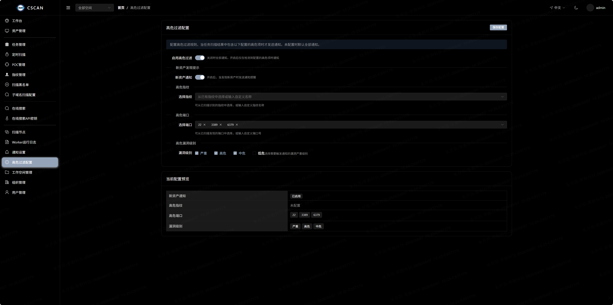
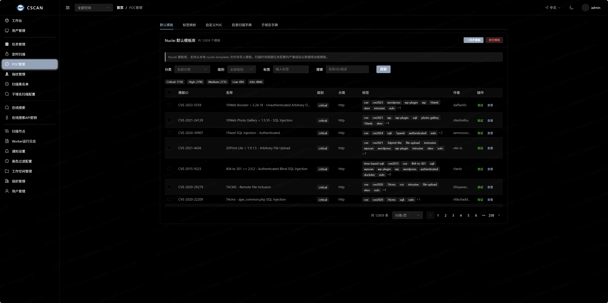
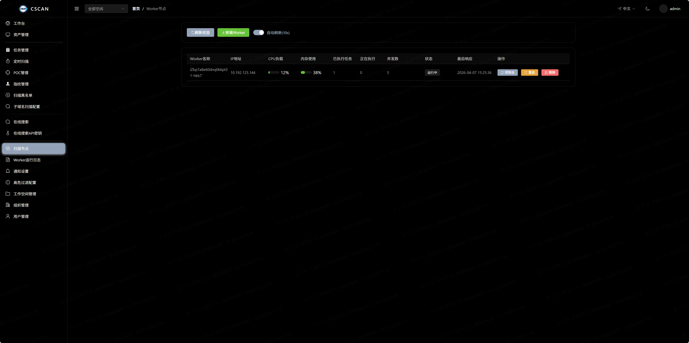

<div align="center">
  
</div>


<div align="center">

**CSCAN-Enterprise Distributed Network Asset Scanning Platform**

[](https://golang.org)
[](https://vuejs.org)
[](LICENSE)
[](VERSION)

[中文](README.md) · [English](README_EN.md)

</div>

---

| Dashboard | Asset Filter | Fingerprint | Vulnerability | Nodes Monitor | Notification |
|:---:|:---:|:---:|:---:|:---:|:---:|
|  |  |  |  |  |  |

---

## Features

### Scanning Engine

| Scan Phase | Description | Tool |
|:---|:---|:---|
| Subdomain Scan | Subdomain enumeration and discovery | Subfinder / Ksubdomain |
| Port Scan | Full/custom port fast scanning | Naabu / Masscan |
| Port Identify | Service version identification | Nmap / Fingerprintx |
| Fingerprint | Web fingerprint & Icon Hash identification | HTTPX / Built-in Engine |
| Brute Scan | Multi-service brute force (SSH/MySQL/Redis/MongoDB/PostgreSQL/MSSQL/FTP/SNMP/Oracle/SMB/MQTT) | Built-in Engine |
| Dir Scan | Directory and file enumeration | FFUF |
| POC Scan | POC vulnerability verification and scanning | Nuclei |

### Core Capabilities

- **Distributed Architecture** - Master/Worker separation, multi-node elastic scaling
- **Pipeline Orchestration** - Scan phases automatically chained, results passed to subsequent phases
- **Weakpass Dict Management** - Built-in default dictionaries, custom dict CRUD, import/export
- **Cron Tasks** - Cron expression-driven periodic scanning tasks
- **Asset Grouping** - Auto-aggregate assets by domain, real-time task status reflection
- **Multi-Workspace** - Tenant-level data isolation, organization/team dimension management
- **Notification** - Real-time scan result push (DingTalk/Feishu/WeCom/Email/Webhook)

---

## Quick Start

```bash
# Clone the repository
git clone https://github.com/tangxiaofeng7/cscan.git
cd cscan

# Linux/macOS
chmod +x cscan.sh && ./cscan.sh

# Windows
.\cscan.bat
```

> Access `https://ip:7777`, default account `admin / 123456`
>
> Worker nodes must be deployed before executing scans

---

## Local Development

```bash
# 1. Start dependencies
docker-compose -f docker-compose.dev.yaml up -d

# 2. Start services
go run rpc/task/task.go -f rpc/task/etc/task.yaml
go run api/cscan.go -f api/etc/cscan.yaml

# 3. Start frontend
cd web ; npm install ; npm run dev

# 4. Start Worker
go run cmd/worker/main.go -k <install_key> -s http://localhost:8888
```

---

## Worker Deployment

```bash
# Linux
./cscan-worker -k <install_key> -s http://<api_host>:8888

# Windows
cscan-worker.exe -k <install_key> -s http://<api_host>:8888
```

---

## License

MIT
